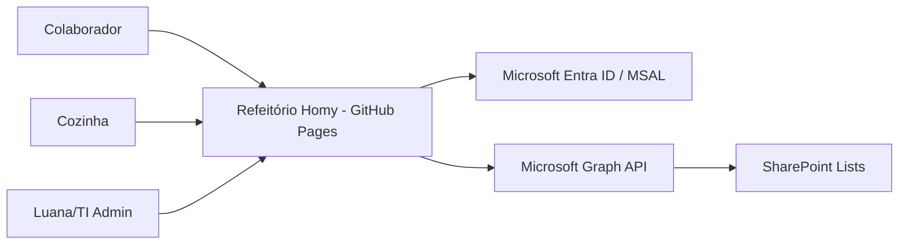
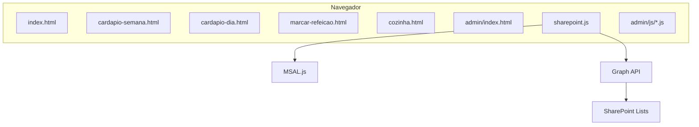

# Arquitetura Técnica

Sistema: Refeitório Homy  
Tipo: Arquitetura  
Responsável: TI Homy  
Última revisão: 18/06/2026  
Versão: 1.1  
Status: Pronto para revisão interna

## 1. Resumo arquitetural

O sistema é um PWA estático servido pelo GitHub Pages. Ele não possui backend próprio. Toda autenticação é feita via Microsoft MSAL e toda leitura/gravação de dados ocorre em listas SharePoint por meio da Microsoft Graph API.

## 2. Stack

| Camada | Tecnologia | Responsabilidade |
|---|---|---|
| Interface | HTML5, CSS3, JavaScript puro | telas do usuário e admin |
| Autenticação | MSAL.js | login com conta Microsoft |
| API | Microsoft Graph API v1.0 | comunicação com SharePoint |
| Dados | SharePoint Lists | armazenamento de negócio |
| Hosting | GitHub Pages | entrega dos arquivos estáticos |
| Relatórios | SheetJS/ExcelJS | exportação Excel |

## 3. Diagrama de contexto



## 4. Containers



## 5. Componentes Admin

| Componente | Arquivo | Responsabilidade |
|---|---|---|
| Core | `admin/js/admin-core.js` | login, navegação e carregamento de módulos |
| State | `admin/js/admin-state.js` | semana atual e módulo ativo |
| Utils | `admin/js/admin-utils.js` | toast, modal, formatação, normalização e escape |
| Dashboard | `admin/js/admin-dashboard.js` | indicadores, toggles, extras, ausências e operação resumida |
| Cardápio | `admin/js/admin-cardapio.js` | CRUD do cardápio semanal |
| Pedidos | `admin/js/admin-pedidos.js` | listagem, filtros, edição e exportação de pedidos |
| Operação do Dia | `admin/js/admin-operacao-dia.js` | status operacional e totais do dia |
| Colaboradores | `admin/js/admin-colaboradores.js` | cadastro e ativação/desativação |
| Extras | `admin/js/admin-extras.js` | visitantes, guardas, investigadores e extras |
| Valores | `admin/js/admin-valores.js` | valores Vascon/desconto |
| Relatórios | `admin/js/admin-relatorios.js` | consultas e exportação Excel |
| Configurações | `admin/js/admin-configuracoes.js` | toggles gerais |

## 6. Fluxo de escrita obrigatório

```text
Usuário altera a interface
-> Módulo JS chama sharepoint.js
-> sharepoint.js chama Microsoft Graph
-> SharePoint confirma gravação
-> Tela recarrega/atualiza usando dados reais do SharePoint
```

## 7. Decisões arquiteturais registradas

- ADR-0001: SharePoint como fonte única de verdade.
- ADR-0002: GitHub Pages sem backend próprio.
- ADR-0003: MSAL com login popup.
- ADR-0004: localStorage apenas como cache técnico do MSAL.
- ADR-0005: documentação no Git + documentação interna formal.

## 8. Pontos críticos

- `sharepoint.js` é a camada de dados central.
- Nomes de listas SharePoint não podem ser renomeados sem ajustar código/documentação.
- IDs HTML usados pelos módulos admin não devem ser removidos.
- Atualizações em autenticação, escopos, redirect URI ou Graph API exigem ADR e teste completo.
